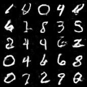

# MNIST DCGAN

A PyTorch implementation of a Deep Convolutional Generative Adversarial Network (DCGAN) trained on the MNIST handwritten digit dataset.

## Overview

This project implements a DCGAN architecture to generate artificial handwritten digits that mimic the MNIST dataset. The implementation follows the standard DCGAN architecture with convolutional and transposed convolutional layers.

## Features

- Generator network that transforms random noise into realistic digit images
- Discriminator network that learns to distinguish between real and generated digits
- Training loop with adversarial loss functions
- Periodic image saving to monitor training progress

## Requirements

- PyTorch
- torchvision
- NumPy
- tqdm

## Usage

1. Clone the repository
2. Run the notebook or script to train the model
3. Generated images will be saved in the `images` directory

## Architecture

### Generator
- Takes a 100-dimensional noise vector
- Uses upsampling and convolutional layers to generate 32×32 images
- Features batch normalization and LeakyReLU activations

### Discriminator
- Takes 32×32 images as input
- Uses strided convolutions to classify images as real or fake
- Includes dropout for regularization

## Training

The model is trained for 200 epochs with a batch size of 64. Adam optimizer with learning rate 0.0002 and betas (0.5, 0.999) is used for both networks.

## Results

After training, the generator produces realistic digit images as shown in the sample output.
